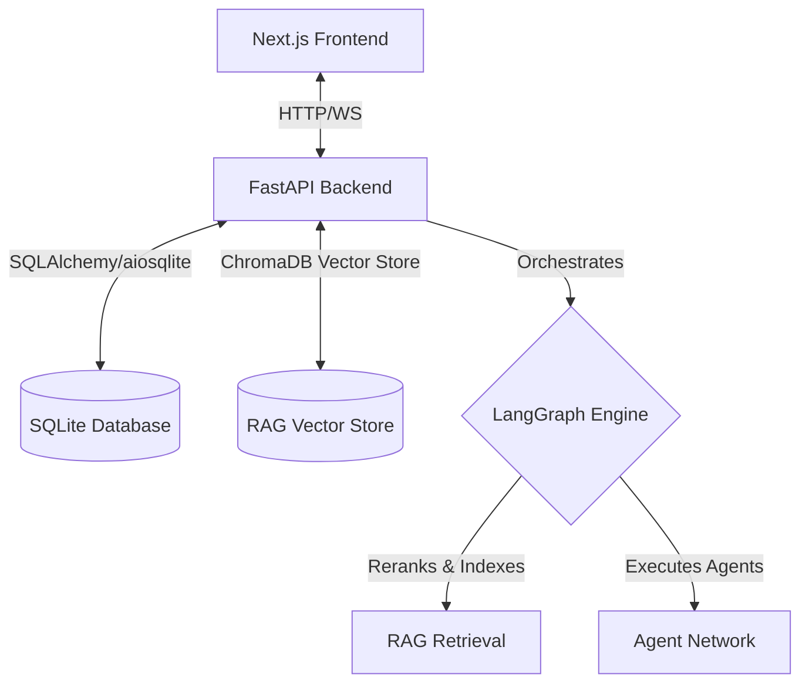

# ∞ ResearchAI: Autonomous Multi-Agent AI Research Platform

An advanced, self-correcting, Retrieval-Augmented Generation (RAG) platform that orchestrates an autonomous network of AI agents to research, verify, write, and export professional reports with data visualizations and citations.

---

## 🚀 Key Features

* **Multi-Agent Orchestration**: Powered by **LangGraph** to coordinate a network of specialized agents executing in a directed acyclic graph (DAG) structure.
* **Intelligent Parallel Scraping**: Concurrent web searching (via Tavily) and PDF layout-parsing (via **Docling**) to crawl and clean source documents.
* **Fact Extraction & Verification**: Maps raw information into *Subject-Attribute-Value* claims and cross-checks them against source texts to calculate credibility scores and filter hallucinations.
* **McKinsey-Style Structured Writing**: Section-by-section drafting with Perplexity-style inline citations `[1]`, `[2]` linked to a verified source index.
* **Automatic Model Fallback & Retry**: Seamless recovery from transient `429 Rate Limit` exceptions with exponential backoff and dynamic failover across models (e.g. `gemini-2.0-flash`, `gemini-2.0-flash-lite`, `gemini-2.5-flash`).
* **Live WebSocket Timeline**: A real-time streaming timeline on the UI showing active agents, progress percentages, and background execution logs.
* **Dynamic Data Visualizations**: Automatically parses numerical metrics from facts to generate and embed customized Plotly data charts.
* **Multi-Format Exporting**: Compiles formatted Markdown drafts into print-ready ReportLab PDFs and Microsoft Word DOCX files.
* **Quality Evaluation Dashboard**: Self-grades completed reports on *Faithfulness, Completeness, Retrieval Quality, and Hallucination Risk*.

---

## 🛠 Technology Stack

### Backend (Python)
* **Framework**: FastAPI (Async, WebSockets)
* **Agent Engine**: LangGraph, LangChain
* **Databases**: SQLite (via SQLAlchemy + `aiosqlite`)
* **Vector Store**: Chroma DB (Semantic RAG index)
* **PDF Engine**: Docling (Layout-aware structure parser)
* **Charts**: Plotly, Kaleido

### Frontend (TypeScript / React)
* **Framework**: Next.js (App Router, Turbopack)
* **Styling**: Tailwind CSS
* **markdown**: react-markdown (GitHub Flavored GFM)
* **API Connection**: WebSockets & custom Axios clients

---

## 📐 System Architecture & Flow



### Agent Pipeline
1. **Planner Agent**: Formulates goals, breaks them down into subtasks, plans charts, and outputs search terms.
2. **Research Agents (Parallel)**:
   * **Search Agent**: Runs Google & Tavily searches to harvest relevant web text snippets.
   * **PDF Agent**: Downloads target whitepapers, parses them via Docling, and index-chunks them into ChromaDB.
   * **Memory Agent**: Retrieves matching factual historical contexts from past jobs.
3. **Extractor Agent**: Filters noise and structured-maps details into clean claims.
4. **Fact Checker Agent**: Cross-verifies claims against contexts, assigning confidence scores.
5. **Writer Agent**: Produces section drafts using cited numbers and details, ensuring duplicate headers are stripped.
6. **Chart Generator Agent**: Populates planned chart placeholders with the extracted verified figures and saves them as PNG assets.
7. **Exporter Agent**: Packages the report, citations, and charts into PDF and Word assets.
8. **Evaluator Agent**: Scores accuracy, completeness, and hallucination safety.

---

## ⚙️ Installation & Setup

### Prerequisites
* Python 3.10+
* Node.js 18+
* Google Gemini API Key
* Tavily Search API Key

### Backend Setup
1. Navigate to the backend directory:
   ```bash
   cd backend
   ```
2. Create and activate a virtual environment:
   ```bash
   python -m venv .venv
   source .venv/bin/activate  # On Windows: .venv\Scripts\activate
   ```
3. Install dependencies:
   ```bash
   pip install -r requirements.txt
   ```
4. Create a `.env` file from the example:
   ```env
   # API Keys
   GOOGLE_API_KEY=your-gemini-key
   TAVILY_API_KEY=your-tavily-key
   
   # Provider Config
   LLM_PROVIDER=gemini
   GEMINI_MODEL=gemini-2.0-flash-lite
   EMBEDDING_MODEL=models/text-embedding-004
   DATABASE_URL=sqlite+aiosqlite:///./data/research.db
   ```
5. Launch the backend server:
   ```bash
   python run.py
   ```

### Frontend Setup
1. Navigate to the frontend directory:
   ```bash
   cd ../frontend
   ```
2. Install npm modules:
   ```bash
   npm install
   ```
3. Set local environment configurations:
   Create a `.env.local` containing:
   ```env
   NEXT_PUBLIC_API_URL=http://localhost:8000
   ```
4. Boot the frontend development server:
   ```bash
   npm run dev
   ```
5. Open your browser to `http://localhost:3000`.

---

## 🔧 Core Architectural Enhancements Made

* **Deduplicated SQLite Session Pools (`NullPool`)**: Configured connection pooling to disable persistent SQLite handles on asyncio background threads. This completely resolves the `database is locked` error.
* **Auto-Rate-Limit Recovery**: Implemented robust exponential fallback loops in `GeminiTool`. In the event of standard `429 Resource Exhausted` API limits, the backend automatically fails over to sibling models (`gemini-2.0-flash-lite`, `gemini-2.5-flash`, etc.) keeping the agents running.
* **Real-time Event Timestamps**: Connected event hooks inside the WebSocket connection layer with UTC dates, resolving React and Next.js hydration dates glitches.
* **Aesthetic Document Cleansing**: Integrated regex stripping pipelines inside the Writer Agent to delete redundant markdown section headers generated during multi-agent assemblies.
